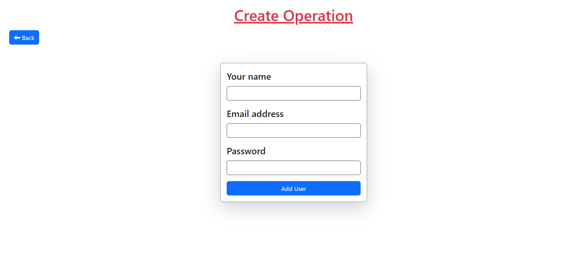
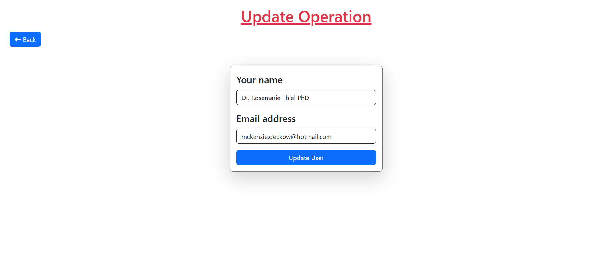

# Laravel CRUD Operation

This project demonstrates a simple **CRUD (Create, Read, Update, Delete)** operation built with Laravel. Users can perform the following actions:

- Add new records to the database.
- Read and display records.
- Update existing user records.
- Delete records from the database.

The project is structured using **migrations**, **factories**, **models**, and **components** for a clean and scalable implementation.

---

## Features

1. **Create**: Add new users to the database.
2. **Read**: Fetch and display a paginated list of users.
3. **Update**: Modify existing user records.
4. **Delete**: Remove users from the database.

---

## Technologies Used

- **Laravel Framework**: Backend logic and routing.
- **Blade Templates**: Frontend templating.
- **Bootstrap**: For styling and responsive UI.
- **MySQL**: Database management.

---

## Project Images

Read and Delete operation

Create operation

update operation
